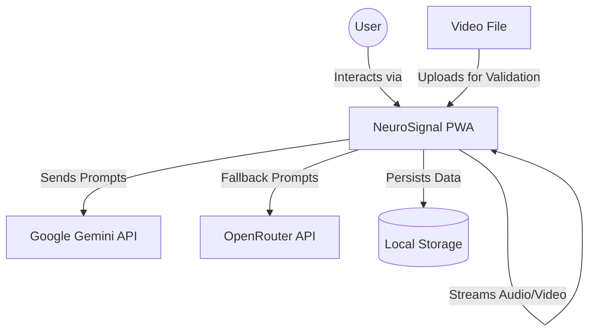

# Architecture & Design

## System Context (C4 Level 1)

NeuroSignal is a client-side Progressive Web Application. It runs entirely within the user's browser, interacting with external AI services for advanced reasoning.

## Container & Component Design

The application is structured around a central **App** container that manages routing (View State) and Authentication.

### Key Components

1.  **AnalysisDisplay (`components/AnalysisDisplay.tsx`)**:
    *   **Core Logic**: Runs the `simulationLoop` (1Hz) to generate `EmotionData`.
    *   **Sensors**: Manages `navigator.mediaDevices` for Camera/Mic OR `HTMLVideoElement` for file playback.
    *   **AI Integration**: Calls `generateSessionInsight` to interpret trends.
    *   **Visualization**: Renders live gauges and `Recharts` timelines.

2.  **Journal (`components/Journal.tsx`)**:
    *   **Persistence**: Reads/Writes to `localStorage`.
    *   **Export**: Generates PDF/CSV reports client-side.

3.  **Services (`services/geminiService.ts`)**:
    *   **Abstraction**: Wraps `@google/genai`.
    *   **Resilience**: Implements exponential backoff and provider fallback (Gemini -> OpenRouter -> Local Heuristics).

## Data Flow: The Analysis Loop

1.  **Input**: `AnalysisDisplay` captures video feed (Live Camera or File).
2.  **Processing**: `setInterval` triggers metric calculation (currently simulated, intended for TensorFlow.js integration).
3.  **State Update**: `currentMetrics` state is updated.
4.  **Aggregation**: Metrics pushed to `sessionData` array.
5.  **Insight**: On user query or periodic trigger, aggregated data is sent to **Gemini Service**.
6.  **Response**: AI returns structured Markdown + optional Image generation prompts.
7.  **Rendering**: UI displays text response and renders generated reference images.

## Design Decisions

*   **No Backend**: Chosen for privacy and zero-cost hosting. All data stays on the device until the user explicitly clears it.
*   **ES Modules**: Uses `esm.sh` for imports to avoid complex build steps during prototyping.
*   **LocalStorage**: Used for simplicity, though creates limits on session storage capacity (see [PROJECT_360_REVIEW.md](PROJECT_360_REVIEW.md)).
